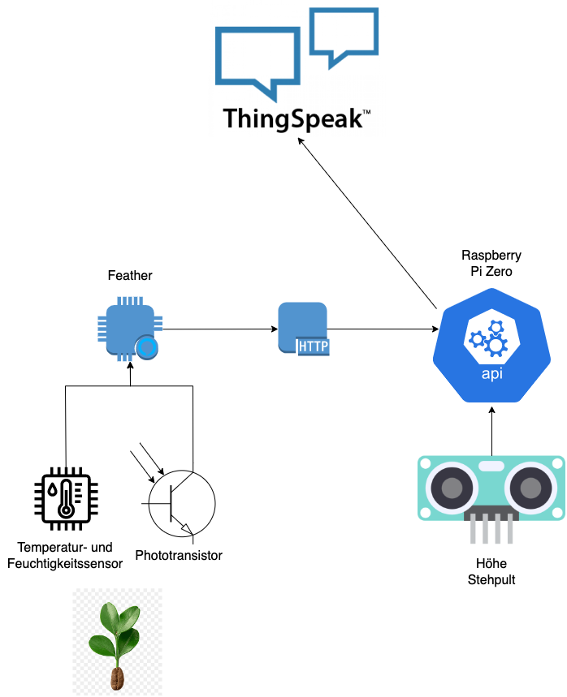

# idb Minichallenge
Dieses Repository enthält die Bearbeitung des Moduls idb des Studienganges Data Science der Fachhochschule Nordwestschweiz. Es werden die Umgebungsbedingungen einer Kaffeepflanze und die Höhe eines Stehpultes gemessen und auf Thingspeak visualisiert. 

## Systemaufbau
Die Umgebungsbedingungen der Kaffeepflanze werden mit einem nRF52840 Mikrokontroller gemessen. Da bei diesem Mikrokontroller eine RTC fehlt, werden die Messwerte an einen Raspberry PI Zero weitergegeben, welcher einen Zeitstempel generiert und die Daten an die Thingspeak API schickt. Auf dem Raspberry PI Zero läuft eine Flask-API, welche die POST-Requests vom nRF52840 annimmt. Die Flask-API akzeptiert alle fünf Minuten Messwerte, der nRF52840 schickt alle 30 Sekunden eine POST-Request um zu überprüfen, ob bereits ein neuer Messwert gesendet werden kann. 

Die Messung der Höhe des Stehpultes läuft separat auf dem Raspberry PI Zero und schickt die Daten direkt an die Thingspeak API. Die Messung erfolgt alle fünf Minuten. 

Beide Programme laufen als Linux-Service. Die Service-Konfigurationen sind unter *raspberry/coffeeplant.service* und *raspberry/sonar.service* zu finden. 

In der nächsten Visualisierung ist der Systemaufbau visualisiert. 

    

